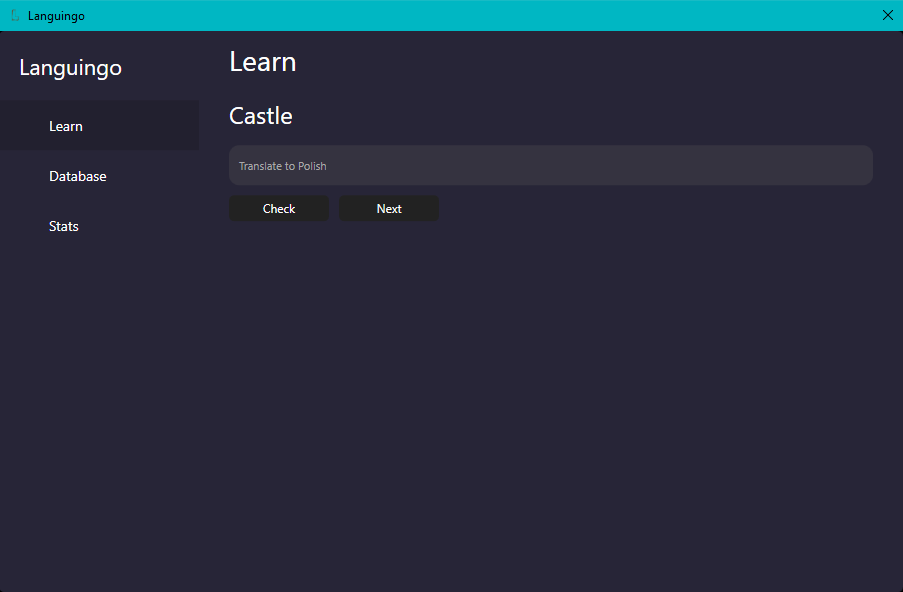
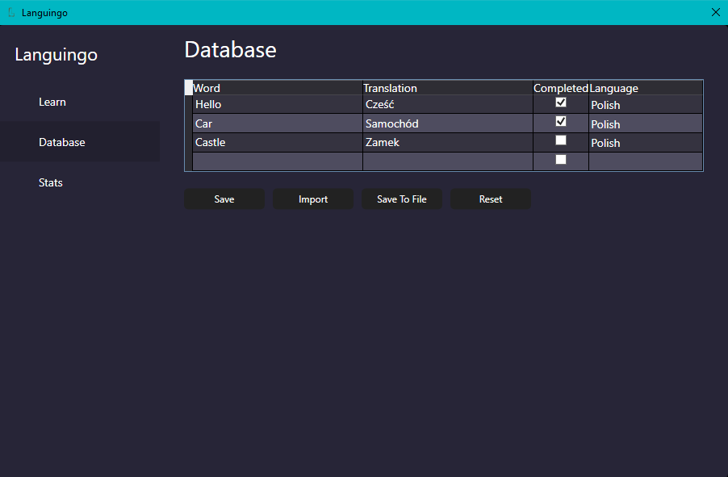
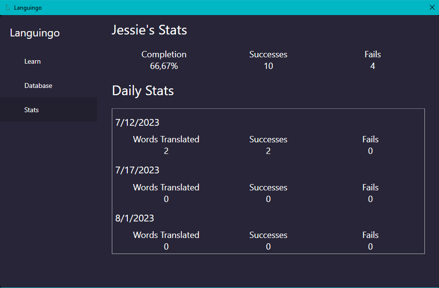

# Language Learning App
  
  
  
This is very simple language learning app. Its main purpose was to learn the very basics of WPF.  
Interface is very simple, yet i did some work to change appearance of default windows look.
## Features
Project has few basic features:
- Interface to learn new words
- Database with words in multiple languages
- Ability to load data to database from txt or json file
- User Stats
## Further Development
I do not plan further development of this app.  
I had some troubles with WPF, really weird errors. WPF is hard platform to develop good app in my opinion, I found xaml and structure of it very confusing sometimes
making very basic features hard to implement
